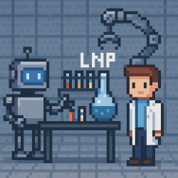

# Multimodal Large Language Models for High-Throughput LNP Optimization



## Overview

This repository provides an **AI-driven laboratory automation toolkit** for optimizing lipid–mRNA nanoparticles (LNPs) and running related multimodal experiments. It integrates robotic execution with multimodal large language models (MLLMs) to accelerate discovery in nanomedicine and beyond.  

The suite builds on workflows described in the manuscript:  
**“Discovering High-Performing Lipid–mRNA Nanoparticle with Multimodal AI and Robotic Automation”**  
(*Yang et al., 2025*).

---

## Capabilities

- **Multimodal AI Assistant**  
  Natural language + vision + tool use via GPT-4o (example) or other advanced models such as **o1**, **o3**, and **GPT-5**.  
  The assistant can perceive lab layouts, plan experiments, and call robotic functions.

- **Robotic Experimentation**  
  Direct integration with Tecan-based liquid handlers, plate movers, and cameras.  
  Supports **combinatorial formulation generation** in 96-well plates.

- **High-Throughput Screening**  
  Automated generation and characterization of **500+ LNP formulations**.  
  Measures particle size, encapsulation efficiency, and transfection potency.

- **Optimization Strategies**  
  - Random search (baseline).  
  - **Bayesian Optimization (BO)** for statistically efficient screening.  
  - **LLM-guided selection** mimicking human decision-making.

- **Visualization Tools**  
  Scripts for **pairwise scatter plots**, **heatmaps**, and benchmarking of optimization strategies.

- **Interactive Interfaces**  
  - Command-line runners (`run_chat.py`, `run_optimizer.py`).  
  - A lightweight **Tkinter GUI** (`gui_o1.py`) for querying models in real time.

---

## Repo Layout

```
lab-automation-suite/
├─ src/
│  ├─ lab_assistant/
│  │  ├─ helpers.py
│  │  ├─ audio_utils.py
│  │  ├─ mllm_chatbot.py
│  │  └─ functions_definition.py
│  └─ optimization/
│     ├─ lnp_optimizer.py
│     ├─ viz_pair_scatter.py
│     └─ viz_heatmap.py
├─ scripts/
│  ├─ run_chat.py
│  ├─ run_optimizer.py
│  └─ gui_o1.py
├─ data/
│  └─ README.md
├─ .env.example
├─ requirements.txt
├─ LICENSE
└─ README.md
```

---

## Quickstart

1. **Setup environment**  
   ```bash
   python -m venv .venv
   source .venv/bin/activate   # or .venv\Scripts\activate on Windows
   pip install -r requirements.txt
   ```

2. **Configure keys**  
   Copy `.env.example` → `.env` and set:  
   - `OPENAI_API_KEY` (required)  
   - `CAMERA_URL` (optional, if using a network camera)

3. **Run multimodal assistant**  
   ```bash
   python -m scripts.run_chat --model gpt-4o
   ```
   *(o1, o3, and GPT-5 are also supported.)*

4. **Run optimizer example**  
   With an `LNP.xlsx` dataset in repo root or `data/`:
   ```bash
   python -m scripts.run_optimizer --n 4 --iterations 5 --repeat 2        --methods Random,BO,EDBO,LLM,R-LLM --xlsx LNP.xlsx
   ```

5. **Launch GUI**  
   ```bash
   python -m scripts.gui_o1
   ```

---

## Notes

- **Audio support (`pyaudio`)**  
  Requires PortAudio.  
  - Linux: `sudo apt-get install portaudio19-dev python3-pyaudio`  
  - macOS: `brew install portaudio`  
  - Windows: install from unofficial wheels if needed.

- **Keyboard input (`keyboard`)**  
  Global hotkeys may require admin/root privileges. If unavailable, the suite falls back to local input.

- **Models**  
  - Examples use **GPT-4o**.  
  - Also compatible with **o1**, **o3**, and **GPT-5**.  
  - GUI defaults: `o1-mini`, `o1-preview`.

- **Environment variables**  
  Keep API keys in `.env`, never commit them.

- **Cross-platform notes**  
  - Works on Linux, macOS, Windows.  
  - Some features (global hotkeys, streaming cameras) may have OS-specific limitations.

---

## Citation

If you use this toolkit, please cite:

Yang X., Zheng Z., Gao W., Shi Y., Wang E. Y., Huang T., Zhang L., Jensen K. F., Langer R. S., Jaklenec A.  
**Discovering High-Performing Lipid–mRNA Nanoparticle with Multimodal AI and Robotic Automation**  2025.

---

## License

MIT License (see [LICENSE](LICENSE))
